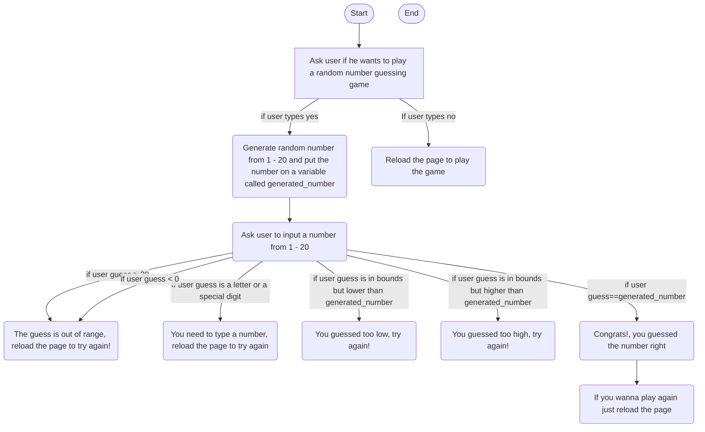

Description of process:
The user opens the page and get asked for input to see if he wants to play,
if the user says no the program ends but if he says yes then the program generates a random number from 1 - 20,
then the program asks the user to type a number from 1 - 20,
if the user types a number thats outside of bounds a message pops up telling him that the number is out of bounds and to try again,
if the user types a letter or a specia digit the program tells the user to type a number and to try again,
if the user guess meets all the requirements but its lower than the number generated the program tells him that his guess was too low,
if the user guess meets all the requirements but its higher than the number generated the program tells him that his guess was too high,
if the guess was correct the program sends out a message congratulating the user and telling him to reload the page if he wanted to play the game again.
